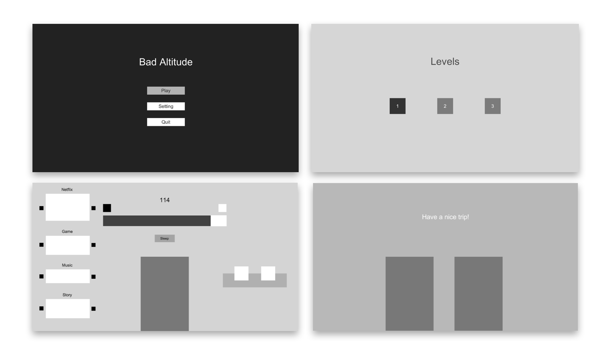

# bad-altitude

<!-- PROJECT LOGO -->
 

* Design not yet implemented *

<h2 align="center">Bad Altitude</h2>

<strong>Bad Altitude is a 2D strategy game in which the player tactically balances between boring his friend to sleep and making him more fun during their flight.</strong>
 
 
<code>Unity</code>
·
<code>C#</code>
·
<code>2D Strategy Game</code>

<!-- TABLE OF CONTENTS -->
# Table of Contents
* [About the Project](#about-the-project)
  * [Built With](#built-with)
* [Getting Started](#getting-started)
  * [Prerequisites](#prerequisites)
  * [Running the Program](#running-the-program)
* [License](#license)

<!-- ABOUT THE PROJECT -->

# About The Project

Due to COVID-19 pandemic, people long for oversea trips. They miss the beautiful ocean and deviation from the routine. However, what comes first? The boring flight or memorable trip? This game humorously addresses the boredom in long flights and reminds people with the forgotten pain that always comes before they go on vacation.  

This is the personal project I am working on. It's currently in developing process. 
Detailed information will be updated shortly in this document.

## Built With

* Unity

<!-- 
## Rules
Win
* Balance mood status appropriately until the end of the flight
Lose
* Once the mood status hits zero, the level ends
Tips
* Only using the fun items is not enough to endure the entire flight
* Only using the boring items results in the mood status hitting zero 
* The mood status decreases slowly over time but it decreases faster once the mood is closer to zero
## Items
1. Netflix
    * Watches a show with high rating ( >= 4 stars): has cool time once used, makes your friend happy
    * Watches a show with low rating ( <= 2 stars): has cool time once used, makes your friend bored
2. Game
    * Lets your friend win: has cool time once used, makes your friend happy
    * Lets your friend lose: has cool time once used, makes your friend bored
3. Music
    * Listens to a loud song: has cool time once used, makes your friend happy
    * Listens to a calm song: has cool time once used, makes your friend bored
4. Story
    * Do funny jokes: has cool time once used, makes your friend happy
    * Do bad jokes: has cool time once used, makes your friend bored
5. Coffee
    * Used with an item that makes your friend happy: can be used once, makes your friend happy 1.3 times
    * Used with an item that makes your friend bored: can be used once, cancels out the effect of the item
6. Tea
    * Used with an item that makes your friend happy: can be used once, cancels out the effect of the item
    * Used with an item that makes your friend bored: can be used once, makes your friend bored 1.3 times
7. Sleep
    * A booster that can be used when your friend is bored for more than 5 seconds. Your friend becomes happy and time flies faster  
## Randomness
Challenges
* unstable flight
* baby crying
Benefits
* in-flight meal   
-->

<!-- GETTING STARTED -->
# Getting Started
These instructions will get you a copy of the project up and running on your local machine for development and testing purposes.
## Prerequisites

* Unity
* Any source-code editor

## Running the Program

1. Click green Code button and download the zip file from github.
2. In Unity Hub, click Add and select the file you downloaded.
3. Go to Game window and click Play

<!--
## Play the Game
Visit the link to play the game. 
 -->

<!-- LICENSE -->
# License

- Yubin Heo
